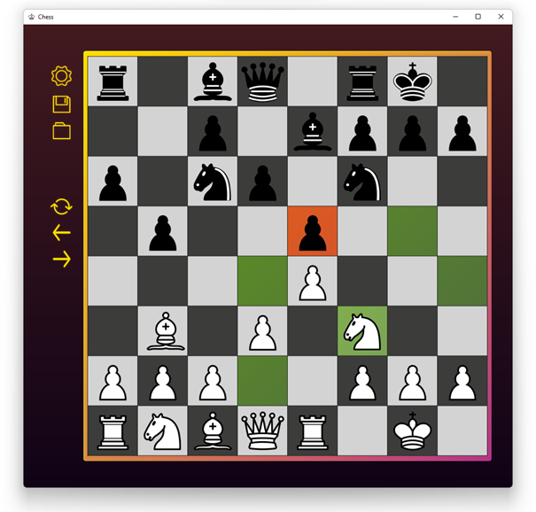
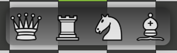
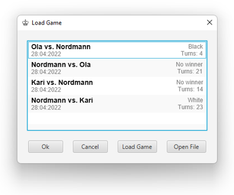
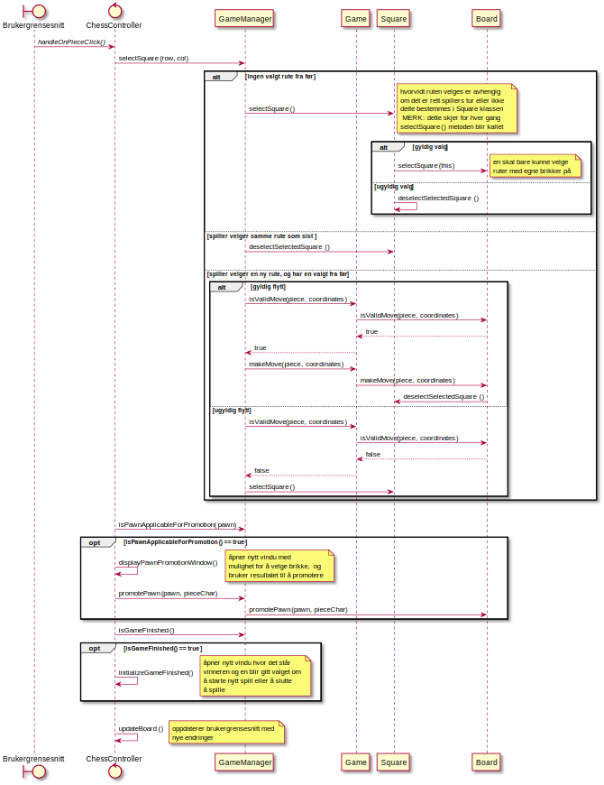

# Sjakkprosjekt TDT4100

Illustrasjonene til brikkene er dekket av *CC3 ASA
Full lisens* og ytterlig informasjon ligger i [licence.txt](src/main/resources/images/license.txt.txt)

**Karakter:** A

## Beskrivelse
Dette prosjektet ble gjennomført som del av prosjektarbeid i faget TDT4100, også kjent som Objektorientert programmering. Sjakkprosjektet er skrevet i Java og bygd med Maven, og dekker alt i pensum. Det ble gjennomført individuelt, og JavaFx er brukt for å skape et dynamisk brukergrensesnitt. For ytterlig beskrivelse, refleksjon og begrunnelser se [dokumentasjon](docs/release1.md).

## Bilder

**Figur 1:** Bilde over brukergrensesnittet til spillet

**Figur 2:** Muligheter for bondepromotering

**Figur 3:** Brukergrensesnitt over lasting av tidligere spill

**Figur 4:** Sekvensdiagram som beskriver hva som skjer når en bruker interagerer med sjakkbrettet til brukergrensesnittet

