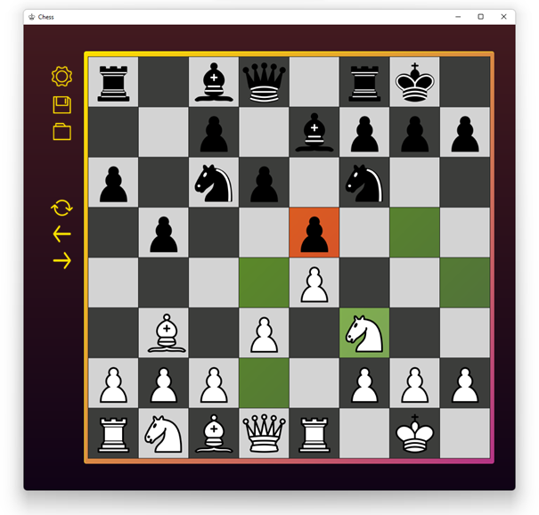
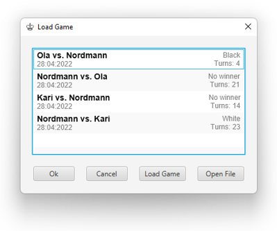

# Dokumentasjon

**Figur 1: Bilde over brukergrensesnittet til spillet**

### Beskrivelse av applikasjon
Prosjektet består av et to-spiller sjakk spill, med all basis-funksjonalitet som begrensning til gyldige flytt, gjenkjenning av sjakk, matt og patt og alle spesialflytt som en passant, rokkering og bondepromotering (se Figur 2).

**Figur 2: Muligheter for bondepromotering**

I tillegg er det implementert ekstrafunksjonalitet som mulighet for å rotere brettet for hver tur, altså den aktive spiller er nederst. Det er også lagt inn mulighet til å navigere gjennom tidligere brettilstander ved bruk av piltastene eller knappene i brukergrensesnittet. Brukergrensesnittet skal også fremheve alle mulige flytt ved å velge en gyldig brikke (se Figur 1).

**Figur 3: Brukergrensesnitt over lasting av tidligere spill**

Underveis, eller etter et endt spill har spiller mulighet til å lagre spillet. Dette inkluderer alle tidligere brettilstander, slik en kan se hvordan spillet har utviklet seg. Deretter kan den laste inn disse tidligere spillene (se Figur 3), og hvis spillet ikke er fullførte eventuelt spille ferdig. Hvis en har spilldata lagret et annet sted er det også mulighet til å hente disse her.
  
## Diagram

**Figur 4: Sekvensdiagram som beskriver hva som skjer når en bruker interagerer med sjakkbrettet til brukergrensesnittet**

Sekvensdiagrammet (Figur 4) beskriver hendelsesforløpet som skjer når en bruker trykker på en rute i sjakkbrettet. Aktør er med hensikt ikke tatt med, da det ikke passer med sekvensdiagrammets nivå av abstraksjon, men en kan tenke seg at det er aktøren som iverksetter ved å trykke på brukergrensesnittet. På dette nivå av abstraksjon er det også verdt å merke at flere steg underveis kan være fjernet, for å skape et mer forståelig sekvensdiagram. Bokser merket med «alt» beskriver forskjellige alternativer som vil skje, avhengig av tilstanden til spillet. Logikken som sjekker hvordan alternativ som skal gjennomføres er ikke med i sekvensdiagrammet, da dette ikke gir en bedre forståelse av hendelsesforløpet. Bokser merket med «opt» vil bare skje hvis tilstanden til spillet innfrir visse krav.

Et sekvensdiagram ble valgt over objektdiagram, klassediagram og objekttilstandsdiagram ettersom en kan beskrive i stor grad hvordan spillet fungerer på et relativt høyt nivå av abstraksjon. Det er veldig mye mer som skjer under panseret, men som ikke er nødvendig å vite om for å forstå hvordan spillet fungerer. En kan gjøre dette med objekttilstandsdiagram, men sekvensdiagram gir en mye ryddigere og mer forståelig måte å vise det. Relasjonene mellom objektene i sjakkspillet er selvsagt viktig, men jeg mener det er viktigere å få frem hvordan *View*, *Controller* og *Model* interagerer, ettersom hele prosjektet er bygd på MVC-prinsippet.
  
## Spørsmål
### **Hvilke deler av pensum i emnet dekkes i prosjektet, og på hvilken måte?**

De fleste deler av pensum dekkes av prosjektet. Blant de viktigste er arv, grensesnitt, java-teknikker, innkapsling, unntakshåndtering, enhetstesting og JavaFX. Arv brukes i prosjektet gjennom at alle brikker arver fra den abstrakte klassen *Piece*. Her arver de metoder og felt som er felles for alle brikker, og har også en egen implementasjon av den abstrakte metoden *getValidMoves*. Med denne løsningen kan jeg bruke en felles hjelpemetode til å finne lovlige flytt. Grensesnitt (*Interface*) brukes i all hovedsak for IO i prosjektet, altså lagring og lasting av sjakkspill. Dette gir muligheten til å utvide til alternative lagringsmåter og eventuelt andre filtyper.

De fleste java-teknikker som dekkes av pensum brukes hyppig i prosjektet. Både *streams* og lambdafunksjoner, med medfølgende funksjonelle grensesnitt nyttes i de fleste klasser, og brukes blant annet til å filtrere flytt eller å gjennomsøke brettet etter brikker eller ruter som oppfyller visse betingelser. Det er ikke stort fokus på *unchecked* og *checked* exceptions i prosjektet, men er verdt å nevnes at begge typer brukes. Av typen *unchecked* er det i all hovedsak *IOException* som er relevant, og for *unchecked* er det unntak som *IllegalArgumentException*, *IllegalStateException* og *IndexOutOfBoundsException*. Jeg kunne gått gjennom resten som oppfyller elementene i pensum, men det er lettere å oppgi at det er i all hovedsak bare bruk av *Comparable*/*Comparator* som mangler.

Teknikker som innkapsling og unntakshåndtering er brukt i alle deler av koden, og er lite som er verdt å kommentere spesifikt på. Enhetstesting ble gjennomført på alle relevante klasser, og JavaFX er en såpass stor del av prosjektet at det dekker det som kreves i pensum. 

Objektorienterte teknikker som delegering og observatør-observert blir brukt i prosjektet. Delegering brukes av flere klasser, spesielt *GameManager*, *Game* og *Board* til å delegere oppgaver til andre klasser. Eksempelvis at *GameManager* delegerer til *Game*, og *Game* delegerer oppgaven videre. Observatør-observert teknikken blir ikke brukt på sin mest rigide form med grensesnitt. Hvis man går litt bort fra grensesnitt brukes teknikken flere ganger i prosjektet, blant annet ved at brettet håndterer et flytt, varsler den til brikken at den har bevegd seg, og varsler til de underliggende rutene at de ikke er valgt lengre.
  
### **Dersom deler av pensum ikke er dekket i prosjektet ditt, hvordan kunne du brukt disse delene av pensum i appen?**
Det finnes ikke noe i prosjektet som jeg trenger sortert, så for nå ville *Comparable*/*Comparator* vært overflødig. Det som jeg kunne tenkt meg å bruke i større grad er Observatør-observert teknikken. Jeg ser for meg at jeg kunne hatt et eget lyttergrensesnitt, for å varsle blant annet at brikkene har bevegd seg, og oppdatere tilstand til rutene. Jeg vurderte å bruke teknikken for å oppdatere brukergrensesnittet om endringer i modellen, men valgte å ikke gjøre dette da jeg ønsket en løsere kopling mellom kontroller og modell.

### **Hvordan forholder koden din seg til Model-View-Controller-prinsippet?**
Gjennom prosjektet har jeg etter all evne forsøkt å holde koden til MVC-prinsippet (*Model*-*View*-*Controller*-prinsippet). Prosjektet er delt opp i tre deler, altså *Model*, *View* og *Controller*. Kontrolleren endrer komponenter i *View* for å gjenspeile endringer i modellen, og det er tilstrebet at koplingen mellom de skal være så løs som mulig. Med det menes at det skal være en kopling mellom delene som kan lett brytes og byttes ut med en annen del. For å oppnå dette har jeg valgt å ha en egen klasse (*GameManager*) som kontrolleren skal forholde seg til, og at den kontrolleren helst ikke skal samhandle direkte med de andre klassene i modellen (til den grad dette er mulig). Da FXML er i stor grad bygd med grunnlag i MVC-prinsippet mener jeg koplingen mellom *Controller* og *View* opprettholder prinsippet i stor grad. Jeg bruker også et CSS-dokument (Cascading Style Sheets) til å enklere kunne oppdatere grensesnittet dynamisk, for å igjen gjøre koplingen mellom *View* og *Controller* løsere.

Koplingen mellom kontrolleren og modell er langt fra perfekt, og jeg skulle gjerne likt å ha løsere kopling. Metoden for å vise brikker og tilstand til sjakkruter bruker noen metoder fra utenfor *GameManager*. Jeg kunne alternativt laget et grensesnitt som *GameManager* og hver eventuelle modell måtte implementere, men jeg fant det unødvendig da jeg bare har en modell.
 
Det er lagret minimalt med tilstand i kontrolleren, som er én instans av *GameManager*. Det er i tillegg tilstrebet å holde bare logikk som omhandler brukergrensesnittet i kontroller.
  

### **Hvordan har du gått frem når dere skulle teste appen deres, og hvorfor har du valgt de testene du har? Har du testet alle deler av koden? Hvis ikke, hvordan har du prioritert hvilke deler som testes og ikke?**
Det er ikke 100 % kodedekning for enhetstestingen til prosjektet. Jeg har valgt å fokusere på metoder og klasser som enten har en stor del logikk eller er kritisk for funksjonaliteten til applikasjonen. Det er umulig å teste alle mulige flytt og situasjoner i sjakk, så jeg har valgt å fokusere på noen vilkårlige situasjoner. For å oppnå dette har jeg spilt meg frem til en relevant tilstand, som jeg så har lagret og videre lastet inn til testene.

Ettersom lagring og lasting er såpass kritisk til enhetstestingen, og en viktig del av prosjektet har delen blitt testet gjennomgående for å forsikre at den fungerer. Merk at prosjektet er bare testet på Windows og MacOS, så det er ingen garanti for at testene fungerer på Linux. Ellers har jeg testet alle brikkene at de har de flyttmulighetene som forventes. Her blir også spesialflytt som er relevant for klassene testet. Muligheten til å velge rute i *GameManager* har også fått prioritet, da en ikke kan spille uten metoden. Metodene i *Board* inneholder veldig mye av logikken som kreves for at spillet skal fungere som det skal, og har derfor også blitt nøye testet. 
  

### **Har du møtt på noen utfordringer i løpet av prosjektet? Hva ville du gjort annerledes en annen gang?**
Jeg hadde vanskeligheter med å få god samhandling mellom brukergrensesnitt, kontroller og view. Skulle jeg gjort dette på nytt ville jeg ha lest meg mer opp på MVC og om gode designmønster som gir gode løsninger. Prosjektet har vært en læringsprosess, så hvis jeg hadde lært mye av det jeg kan nå på forhånd har det selvsagt hjulpet underveis.

